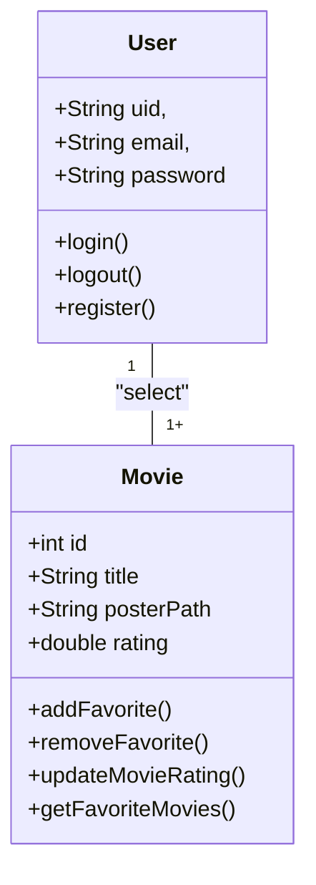
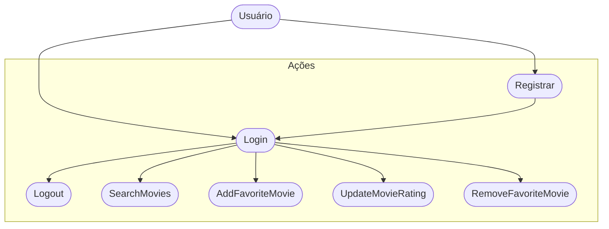

# CineFavorite (Formativa)

## Briefing
Construir um Aplicativo do Zero - O CineFavorite que permitirá criar uma conte e buscar filmes em uma API, montar uma galeria pessoal de filmes favoritos, com poster(capa) e nota avaliativa do usuário para o filme.

## Objetivos
- Criar uma Galeria Personalizada por Usuário de Filmes Favoritos
- Buscar Filmes em uma API e Listar para selecionar filmes favoritos
- Criação de Contas por Usuário
- Listar filmes por Palavra-Chave

## Levantamento de Requistos
- ### Funcionais
- ### Não Funcionais

## Recurso do Projeto
- Linguagem de Programação: Flutter/Dart
- API TMDB: Base de Dados para Filmes
- Figma: Prototipagem
- GitHub: para Armazenamento e Versionamento do Código
- FireBase: Authentication / FireStore DB
- VsCode: Codificação / Teste

## Diagramas
1. ### Classe: 
Demosntrar o Funcionamento das Entidades do Sistema
- Usuário (User): Classe já modelada pelo FireBaseAuth
    - Atributos: email, senha, uid
    - Métodos: login, registrar, logout

- Filmes Favoritos (Movie): Classe Modelada pelo DEV - Baseada na API TMDB
    - Atributos: id, título, PosterPath, Nota
    - Métodos: Adicionar, remover, listar, atualizatNota (CRUD)



2. ### Uso
Ação que os Atores podem Fazer
- Usuário:
    - Registar
    - Login
    - Logout
    - Procurar Filmes na API
    - Salvar Filmes aos Favoritos
    - Dar Nota aos Filmes Favoritos
    - Remover Filmes dos Favoritos



3. ### Fluxo
Determinar o Caminho Percorrido pelo Ator para executar uma Ação

- Fluxo da Ação de Login

```mermaid

    A[Início] --> B{Tela de Login}
    B --> C[Inserir Email e Senha]
    C --> D{Validar as Credenciais}
    D --> Sim --> G[Favorite View]
    D --> Não --> B

```

## Protopipagem

Link dos Protótipos

##